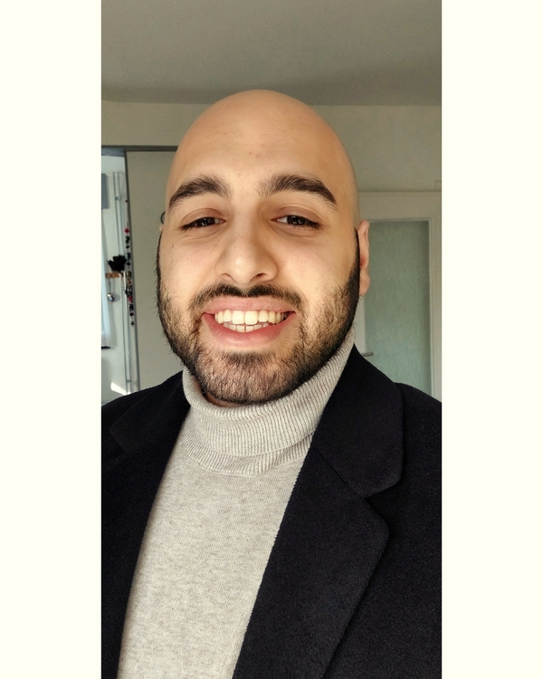

# Semih Bekki

```
_L'homme a besoin de ce qu'il y a de pire en lui s'il veut parvenir à ce qu'il a de meilleur._
```



### Junior Web Developer à BeCode à temps plein!

### Quelques infos personnelles...

| Birthday            |      11/05       |
| Favorite color      |    bleue nuit    |
| Favorite food       | Lahmacuns :wink: |
| Pinneapple on pizza |     [JAMAIS]     |


### HOBBIES
- Musique :musical_note:
- Musculation :muscle:
- Philosophie :brain:
  - Nietzsche
- Histoire :open_book:
- Jeux vidéos (à certaines périodes) :video_game:
  - Portal 2
  - Rocket League
  - FIFA

### You can always count on me when...
On a besoin d'être accompagné. 
Nous sommes tous des êtres humains avec des parcours différents et des tempéraments différents.
L'infaillible n'existe pas, l'important est de toujours chercher à grandir et à s'améliorer.
Pour cela, il faut faire preuve de Raison et non de ressentiments. 
Il nous arrive de ne pas pouvoir réussir à atteindre la sérénité de l'âme pour utiliser sa Raison, dans ce cas-là, il est souvent utile d'être accompagné pour réussir à y parvenir.
On peut compter sur moi en période d'angoisse et d'anxiété.

### A funny story

#### TL;DR

:arrow_left: [previous](https://github.com/SemihBk/markdown-challenge)  SEMIH BEKKI [after](https://github.com/SemihBk/markdown-challenge) :arrow_right:	

